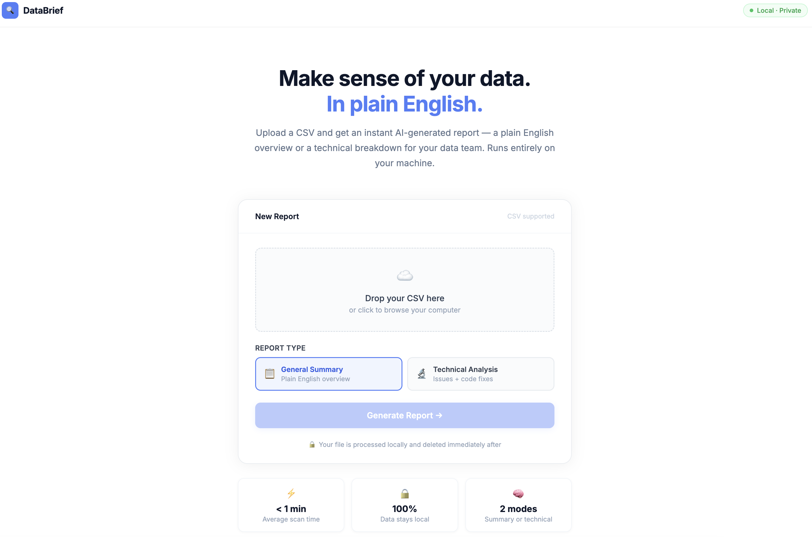

# DataBrief

> AI-powered data reports that run 100% on your machine.
> No cloud. No data exposure. No subscription.

DataBrief analyses your CSV files and generates clear reports 
using a local AI model — either a plain English summary for 
stakeholders, or a technical breakdown with code fixes for 
your data team.

**Everything runs locally. Your data never leaves your computer.**


---

## Requirements

Before you start, make sure you have these installed:

- Python 3.9 or higher → https://www.python.org/downloads/
- Node.js 18 or higher → https://nodejs.org
- Ollama → https://ollama.com/download

---

## Installation

### 1. Download the project
Either clone with Git or download the zip from the repository.
```bash
git clone https://github.com/yourname/databrief.git
cd databrief
```

### 2. Install Python dependencies
```bash
cd backend
pip install -r requirements.txt
cd ..
```

### 3. Install frontend dependencies
```bash
cd frontend
npm install
cd ..
```

### 4. Download the AI model
```bash
ollama pull llama3
```
This downloads a 4GB model — only needed once.

---

## Running the App

From the `databrief` folder, run:
```bash
./start.sh
```

Then open your browser at:
```
http://localhost:5173
```

To stop the app press `Ctrl + C`.

---

## Privacy

Your data never leaves your machine.

- Uploaded files are read into memory and deleted immediately after
  your report is generated
- The AI model runs locally via Ollama
- Nothing is sent to any external server

---

## Troubleshooting

**"Cannot connect to Ollama"** 

Run `ollama serve` in a separate terminal and try again.

**"Module not found" error**

Make sure you ran `pip install -r requirements.txt` from
the `backend` folder.

**App won't start**

Make sure both Python and Node are installed:
```bash
python --version
node --version
```